# Fyga Music

Aplicación web de música construida con HTML, CSS y JavaScript vanilla, que consume la API de Deezer a través de un proxy en Vercel. Permite buscar canciones, reproducir previews y organizar tu música en playlists personalizadas con autenticación de Firebase.

**Demo en vivo:** [fyga-e313e.web.app](https://fyga-e313e.web.app)

---

## Características

- **Búsqueda de canciones y artistas** en tiempo real vía Deezer API
- **Reproducción de previews** de 30 segundos directamente en el navegador
- **Playlists personalizadas** — crea, nombra y administra tus listas
- **Autenticación** con Google y correo/contraseña (Firebase Auth)
- **Diseño responsivo** — funciona en escritorio y móvil
- **Sin frameworks** — Vanilla JS puro, carga rápida

---

## Capturas de pantalla

### Pantalla principal

| PC | Móvil |
|:--:|:-----:|
|  | 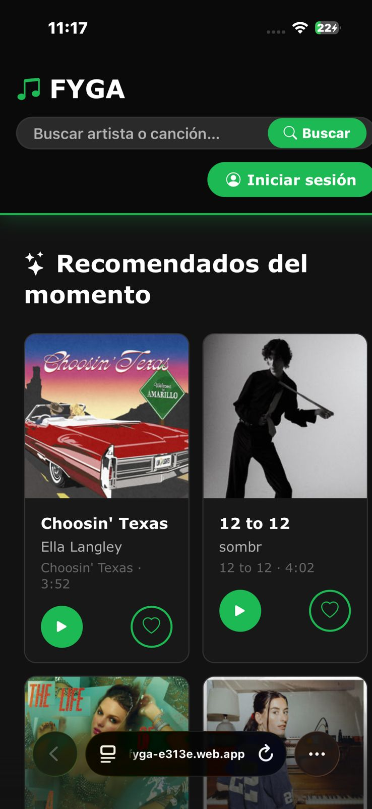 |

### Autenticación

| Inicio de sesión PC | Inicio de sesión Móvil |
|:-------------------:|:----------------------:|
| 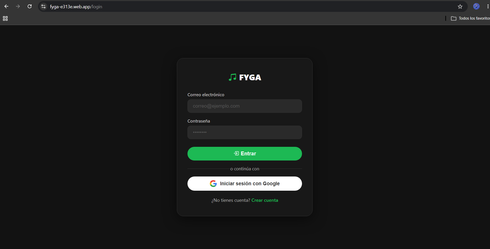 | 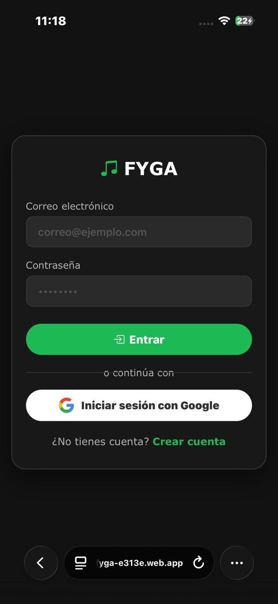 |

| Crear cuenta PC | Crear cuenta Móvil |
|:---------------:|:-----------------:|
| 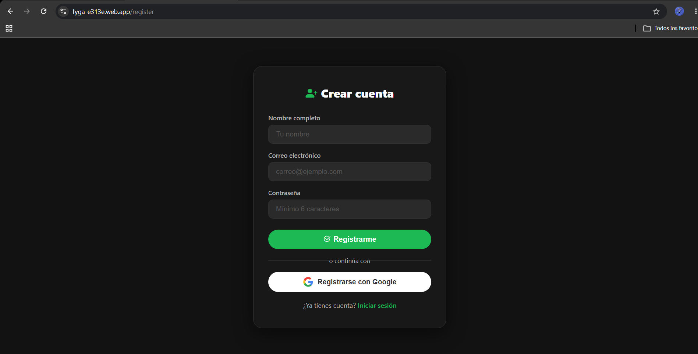 | 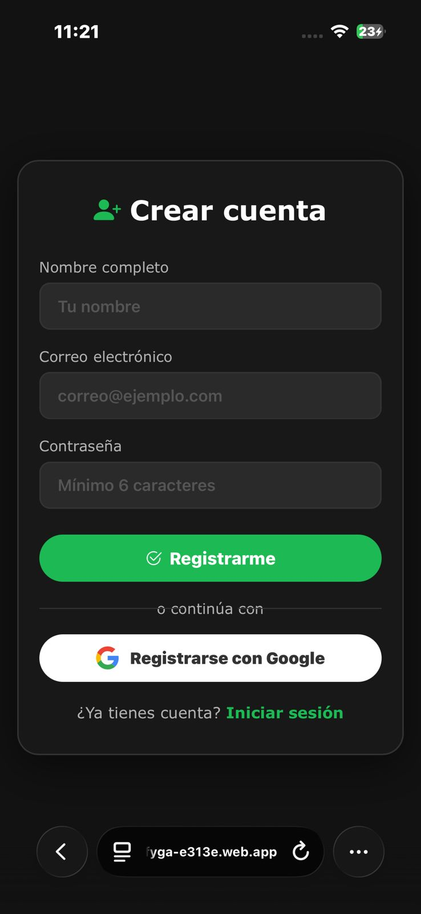 |

| Sesión iniciada con Google PC | Sesión iniciada Móvil |
|:-----------------------------:|:---------------------:|
| 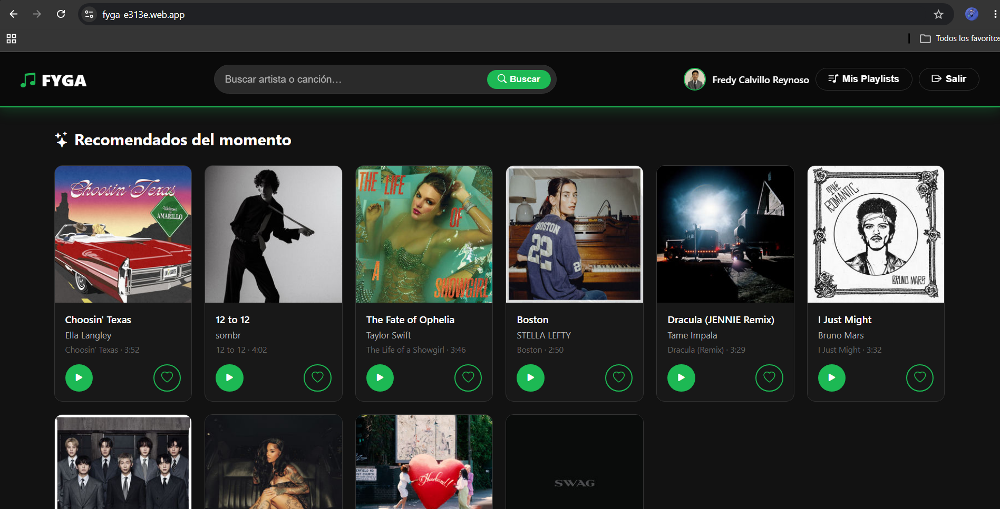 | 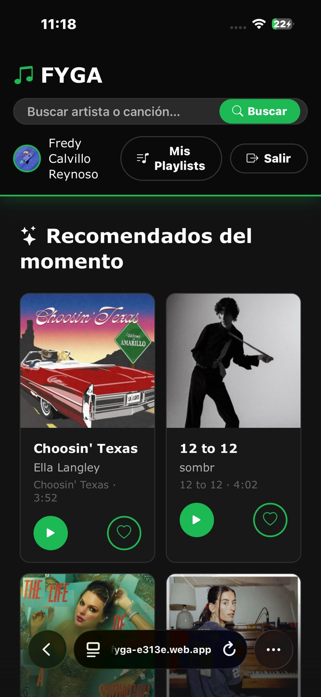 |

### Búsqueda

| Búsqueda PC | Búsqueda Móvil |
|:-----------:|:--------------:|
|  | 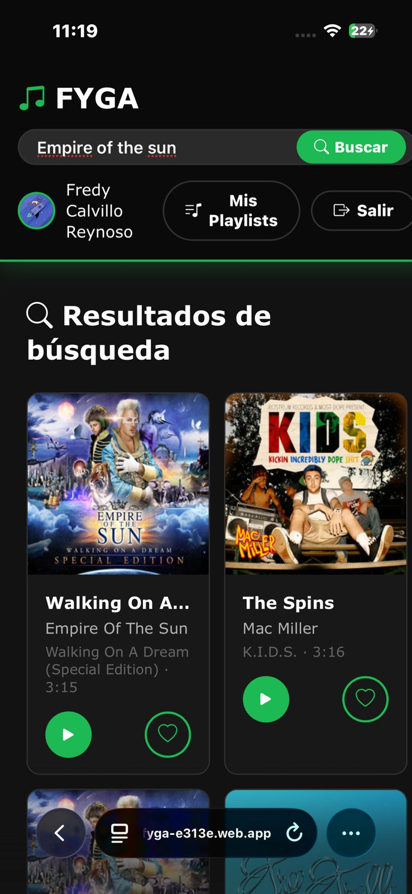 |

### Playlists

| Playlists vacías PC | Playlists vacías Móvil |
|:-------------------:|:----------------------:|
| 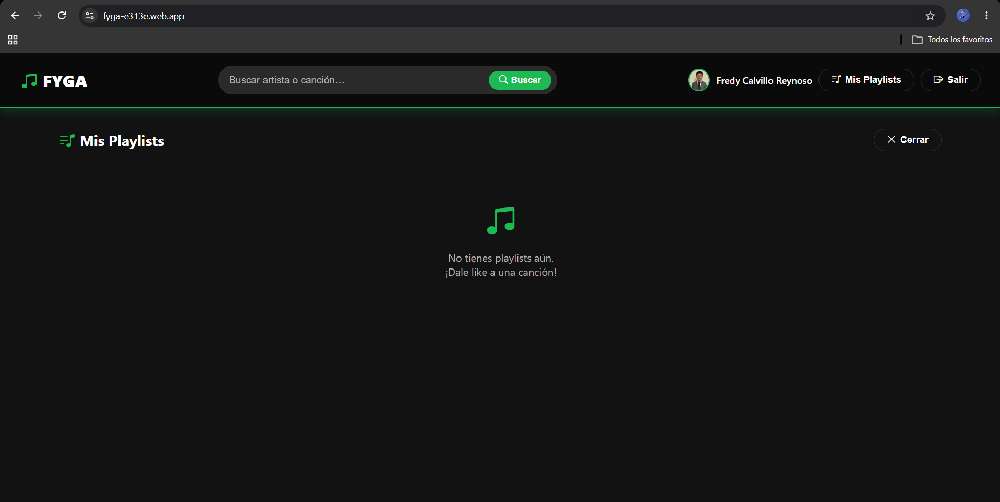 | 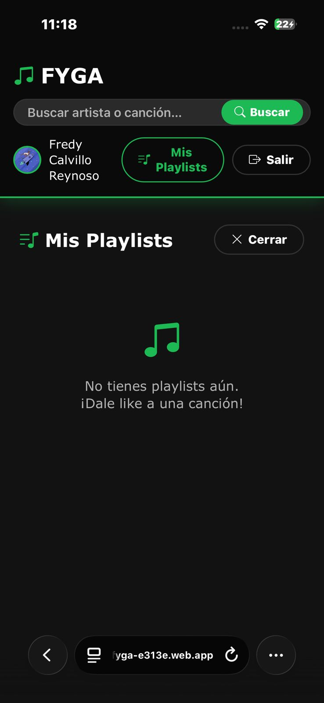 |

| Crear playlist PC | Crear playlist Móvil |
|:-----------------:|:--------------------:|
|  |  |

| Notificación playlist creada PC | Notificación playlist creada Móvil |
|:-------------------------------:|:----------------------------------:|
|  |  |

| 2 Playlists creadas PC | |
|:----------------------:|:-:|
| 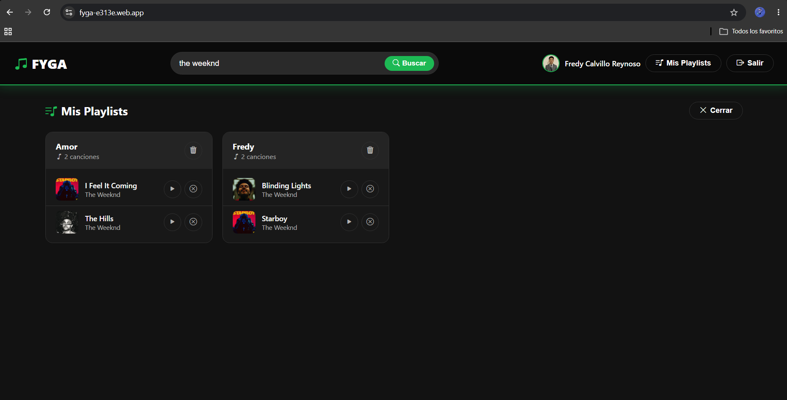 | |

### Agregar canciones a playlists

| Agregar canción PC | Agregar canción Móvil |
|:------------------:|:---------------------:|
|  |  |

| Canciones agregadas PC | Canciones agregadas Móvil |
|:----------------------:|:-------------------------:|
| 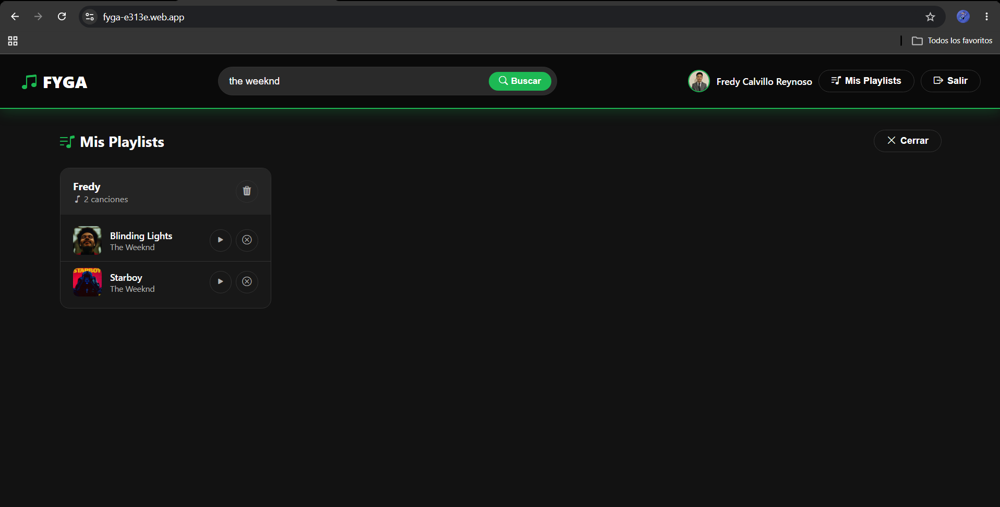 | 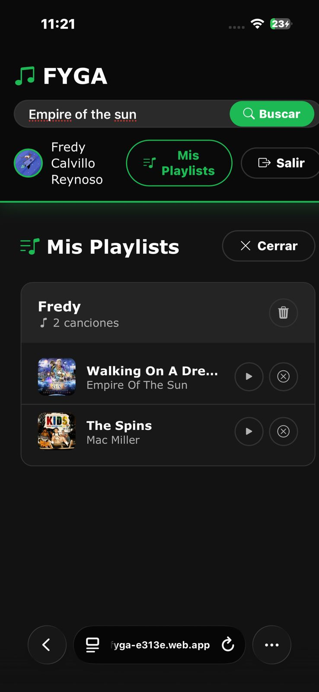 |

| Canción agregada Móvil |
|:----------------------:|
| 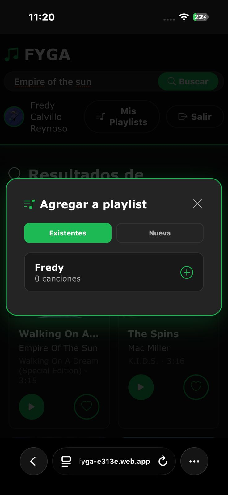 |

---

## Tecnologías

| Capa | Tecnología |
|------|-----------|
| Frontend | HTML5, CSS3, JavaScript (ES Modules) |
| Autenticación | Firebase Auth (Google + Email/Password) |
| Base de datos | Cloud Firestore |
| API de música | Deezer API (via proxy Vercel) |
| Hosting | Firebase Hosting |
| Proxy | Vercel Serverless Functions |

---

## Instalación local

### Prerrequisitos

- Cuenta en [Firebase](https://firebase.google.com)
- Cuenta en [Vercel](https://vercel.com) (para el proxy de Deezer)
- Navegador moderno con soporte para ES Modules

### Pasos

1. **Clona el repositorio**
   ```bash
   git clone https://github.com/tu-usuario/fyga-music.git
   cd fyga-music
   ```

2. **Configura Firebase**

   Renombra el archivo de ejemplo y coloca tus credenciales:
   ```bash
   cp assets/js/firebase-config.example.js assets/js/firebase-config.js
   ```
   Luego edita `assets/js/firebase-config.js` con los datos de tu proyecto Firebase (los encuentras en **Configuración del proyecto → Tus apps** en la consola de Firebase).

3. **Configura el proxy de Deezer**

   El archivo `api/deezer.js` apunta a un proxy en Vercel para evitar problemas de CORS con la API de Deezer. Despliega tu propio proxy o actualiza la constante `PROXY` con tu URL:
   ```js
   const PROXY = 'https://tu-proxy.vercel.app/api/deezer';
   ```

4. **Sirve el proyecto localmente**

   Como usa ES Modules, necesitas un servidor HTTP (no abrir el HTML directamente):
   ```bash
   npx serve .
   # o con Python
   python -m http.server 8080
   ```

5. **Abre** `http://localhost:8080` en tu navegador.

---

## Estructura del proyecto

```
fyga_music/
├── index.html                  # Página principal
├── login.html                  # Inicio de sesión
├── register.html               # Registro de cuenta
├── users.html                  # Panel de usuario
├── firebase.json               # Configuración Firebase Hosting
├── api/
│   └── deezer.js               # Cliente del proxy de Deezer
├── assets/
│   ├── css/
│   │   └── styles.css          # Estilos globales
│   └── js/
│       ├── app.js              # Lógica principal
│       ├── auth.js             # Manejo de autenticación
│       ├── admin.js            # Funciones de administración
│       └── firebase-config.example.js  # Plantilla de configuración
└── Docs/                       # Capturas de pantalla
```

---

## Seguridad

- El archivo `assets/js/firebase-config.js` con tus credenciales reales está en `.gitignore` — **nunca lo subas a un repositorio público**.
- Usa las [reglas de seguridad de Firestore](https://firebase.google.com/docs/firestore/security/get-started) para proteger tu base de datos.
- Configura los dominios autorizados en Firebase Auth → **Configuración → Dominios autorizados**.

---

## Licencia

MIT — libre para uso personal y educativo.
