# VitalSync

VitalSync es una aplicación web orientada a la gestión de información médica de pacientes. Permite registrar los datos clínicos y de contacto de un paciente, ubicarlo en un mapa y visualizar un panel de monitoreo de signos vitales preparado para conectarse a un dispositivo wearable (reloj inteligente).

## Demo en vivo

🔗 [https://vital-sync-d6b45.web.app](https://vital-sync-d6b45.web.app)

## Capturas de pantalla

### Vista de escritorio

| Inicio | Iniciar sesión | Registro de paciente |
|---|---|---|
| 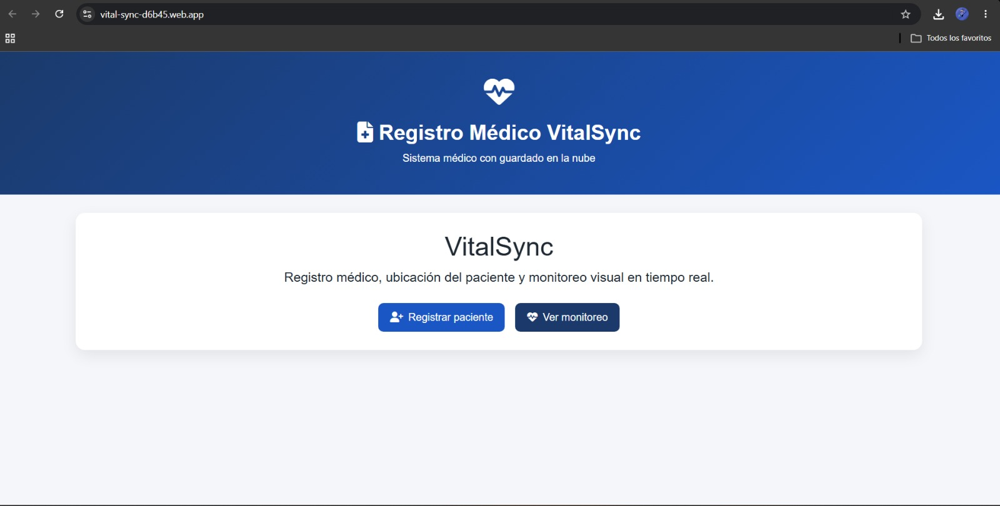 | 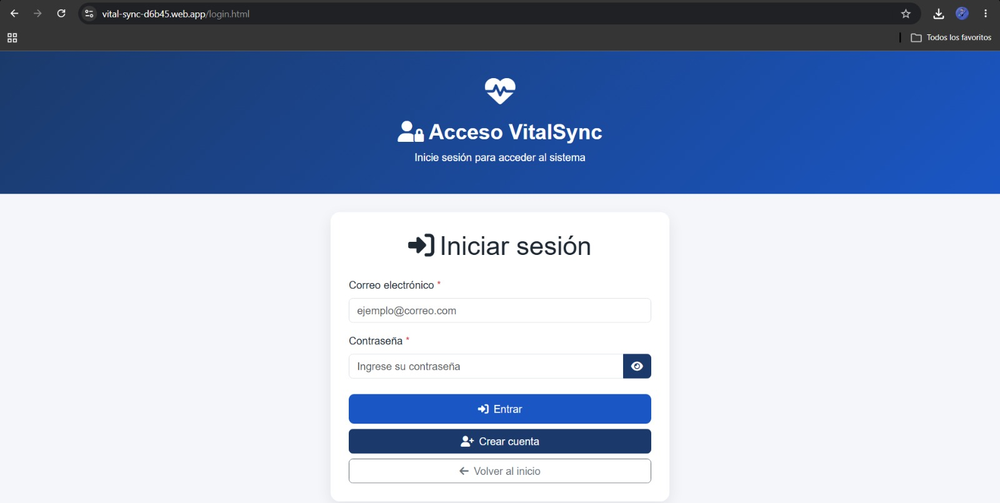 | 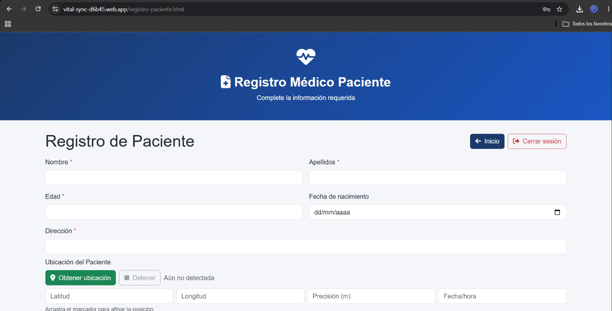 |

| Datos médicos | Antecedentes | Monitoreo |
|---|---|---|
| 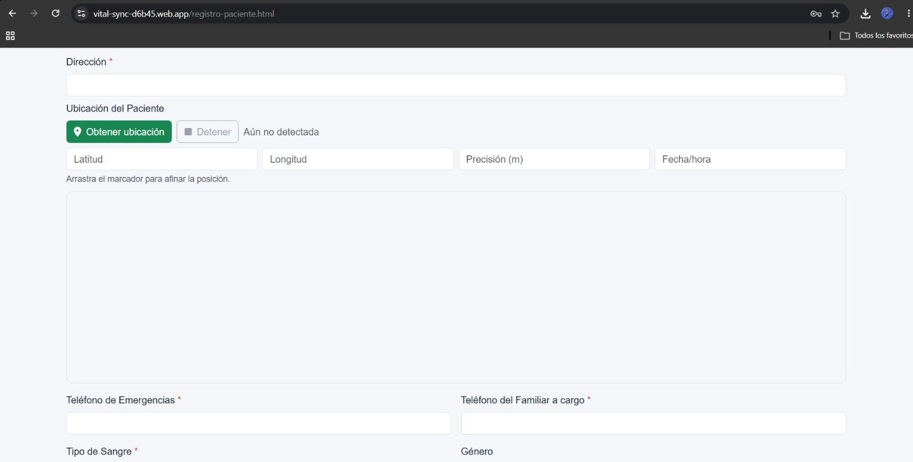 | 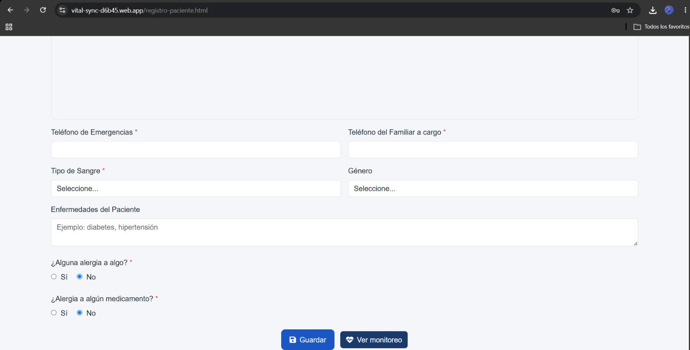 | 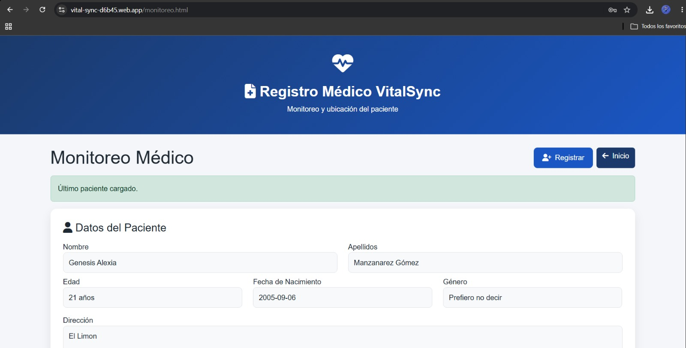 |

| Datos del paciente | Signos vitales | Ubicación |
|---|---|---|
| 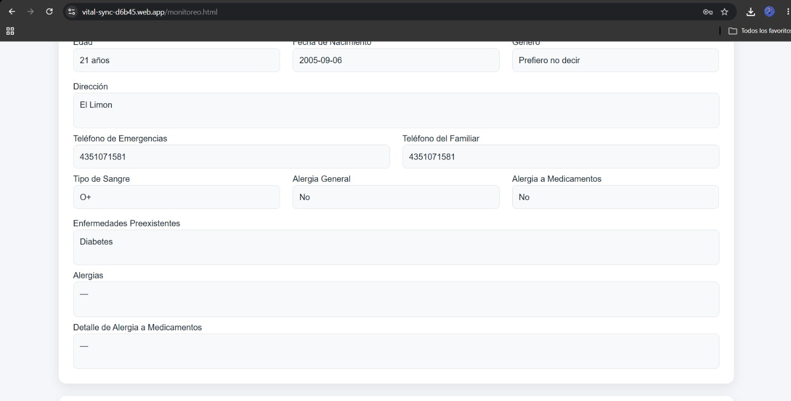 | 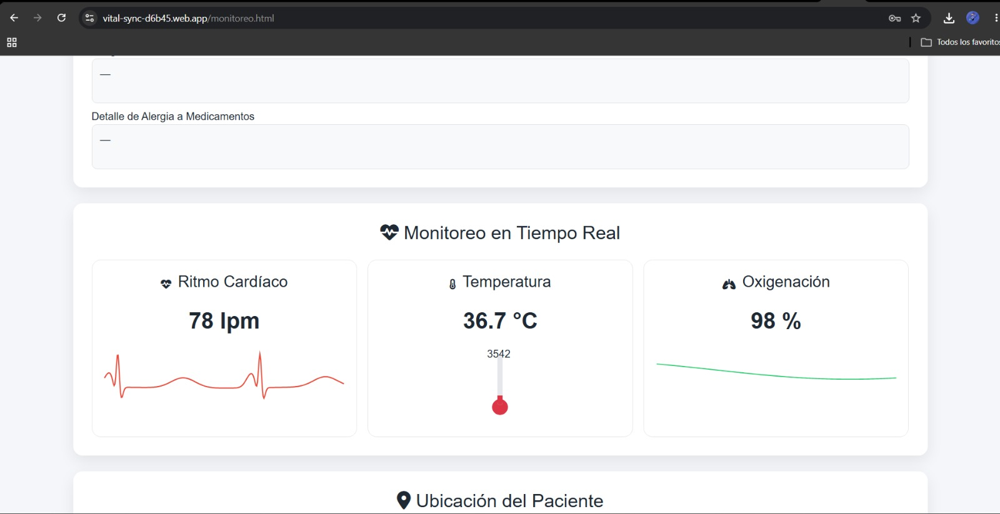 | 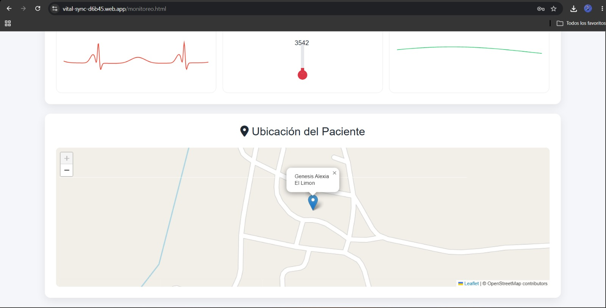 |

### Vista móvil (iPhone)

| Inicio | Iniciar sesión | Registro |
|---|---|---|
| 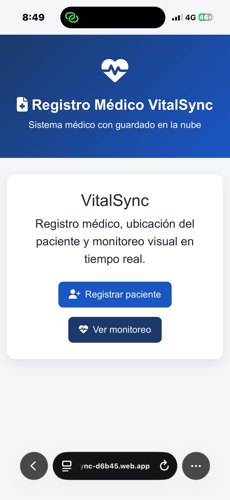 | 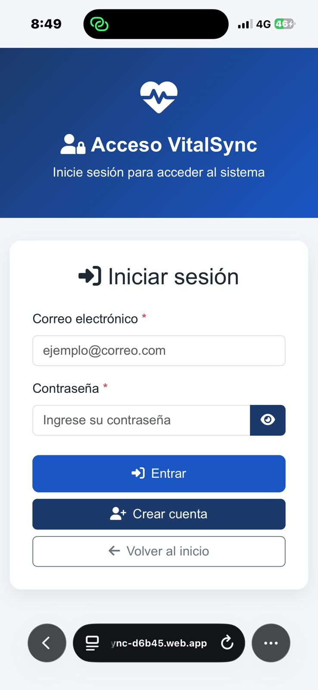 | 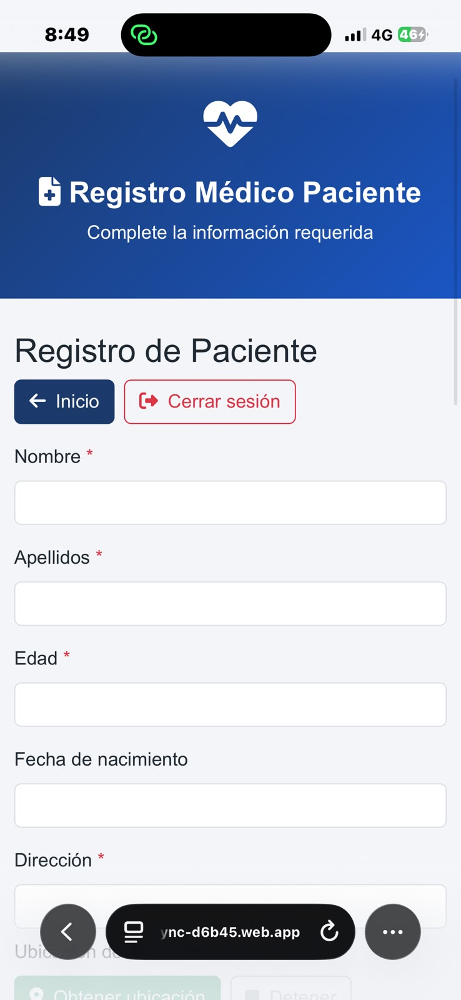 |

| Ubicación | Datos médicos | Registro completo |
|---|---|---|
| 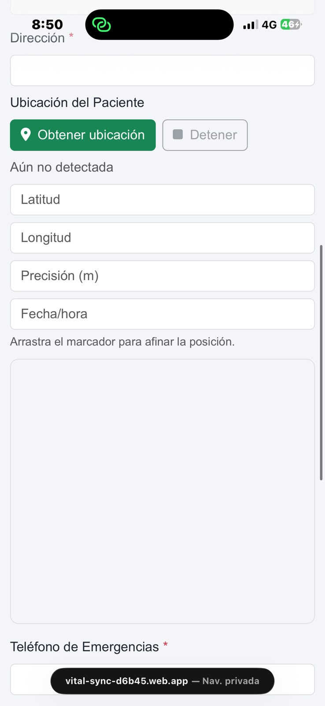 | 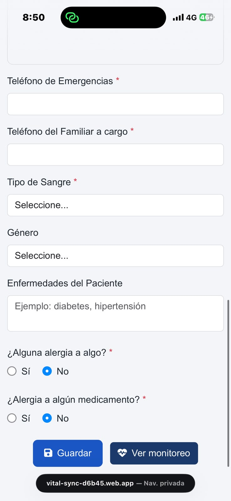 | 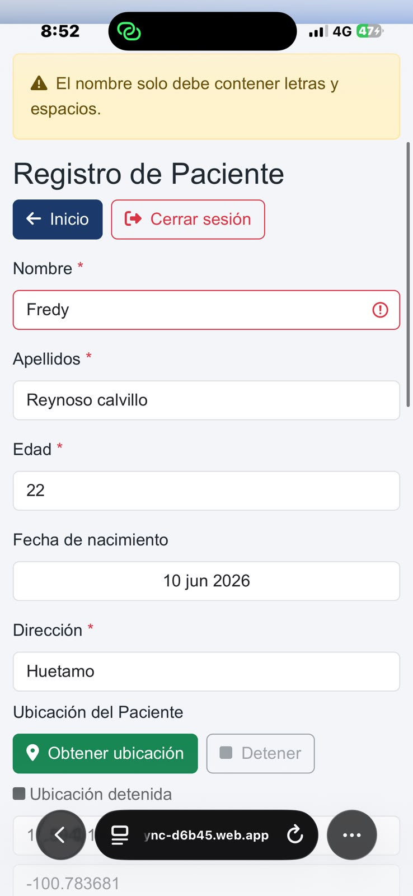 |

| Monitoreo - datos del paciente | Signos vitales | Ubicación en el mapa |
|---|---|---|
| 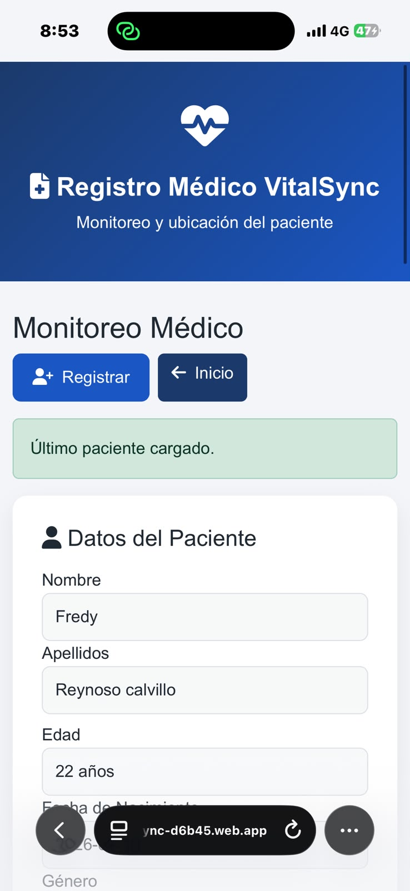 | 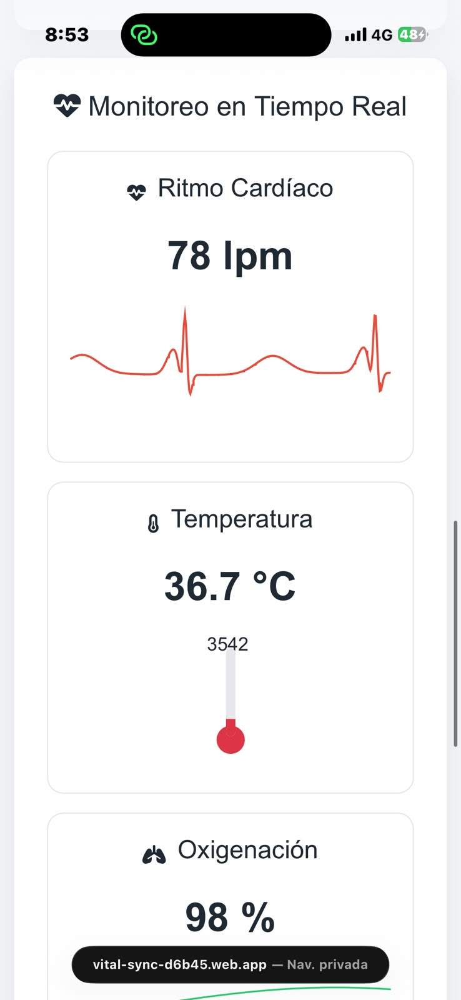 | 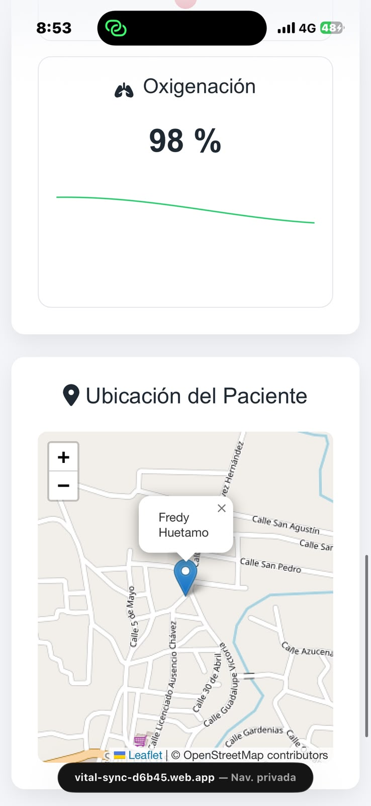 |

## Características

- **Autenticación de usuarios** con Firebase Authentication (correo y contraseña), una cuenta por paciente.
- **Registro de pacientes**: formulario validado con datos personales, de contacto, médicos y de emergencia.
- **Persistencia en la nube** con Cloud Firestore, protegida con reglas de seguridad que garantizan que cada usuario solo pueda leer y escribir su propio expediente.
- **Geolocalización**: captura y muestra la ubicación del paciente en un mapa interactivo (Leaflet + OpenStreetMap).
- **Panel de monitoreo**: visualización de señal ECG, pletismografía, frecuencia cardiaca, temperatura y oxigenación, listo para integrarse con datos en tiempo real de un dispositivo wearable.
- **Sesión segura**: la sesión se cierra automáticamente al cerrar el navegador, evitando que distintos pacientes compartan una sesión activa en un mismo dispositivo.

## Tecnologías

- HTML5, CSS3, Bootstrap 5
- JavaScript (ES Modules)
- Firebase Authentication
- Cloud Firestore
- Chart.js
- Leaflet.js
- Firebase Hosting

## Estructura del proyecto

```
public/
├── index.html                 # Página principal
├── login.html                  # Acceso al sistema
├── registro-paciente.html      # Formulario de registro de paciente
├── monitoreo.html               # Vista de monitoreo y datos del paciente
├── gracias.html                 # Confirmación de registro
└── assets/
    ├── css/
    │   ├── styles.css
    │   ├── registro.css
    │   └── monitoreo.css
    └── js/
        ├── guardado-config.js    # Configuración e inicialización de Firebase
        ├── auth.js               # Inicio/cierre de sesión
        ├── route-guard.js        # Protección de rutas privadas
        ├── login.js               # Lógica de la pantalla de acceso
        ├── registro-paciente.js   # Validación y envío del formulario
        ├── pacientes-service.js   # Lectura/escritura de pacientes en Firestore
        ├── ubicacion.js           # Geolocalización y mapa de registro
        └── monitoreo.js           # Gráficas y panel de monitoreo
```

## Modelo de datos (Firestore)

Cada paciente se almacena como un documento en la colección `pacientes`, usando como ID el `uid` de su cuenta de Firebase Authentication:

```
pacientes/{uid}
├── nombre, apellidos, edad, fechaNacimiento, genero
├── direccion, telefonoEmergencias, telefonoFamiliar
├── tipoSangre, enfermedades, alergias, medicamentos
├── latitud, longitud
└── fechaActualizacion
```

### Reglas de seguridad

```js
rules_version = '2';

service cloud.firestore {
  match /databases/{database}/documents {
    match /pacientes/{userId} {
      allow read, write: if request.auth != null
                          && request.auth.uid == userId;
    }
  }
}
```

## Ejecución local

1. Clona el repositorio.
2. Instala el [Firebase CLI](https://firebase.google.com/docs/cli) si no lo tienes:
   ```bash
   npm install -g firebase-tools
   ```
3. Inicia sesión y emula el proyecto:
   ```bash
   firebase login
   firebase emulators:start
   ```
   o sirve la carpeta `public/` con cualquier servidor estático.

## Despliegue

```bash
firebase login
firebase deploy --only hosting
```

## Próximos pasos

- Integración con un reloj inteligente (wearable) para mostrar signos vitales en tiempo real.
- Historial de mediciones por paciente.
- Notificaciones ante valores fuera de rango.

---

Proyecto desarrollado por Fredy Calvillo Reynoso como parte de su portafolio de evidencias.
